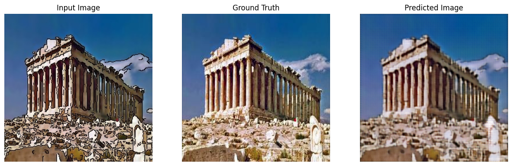
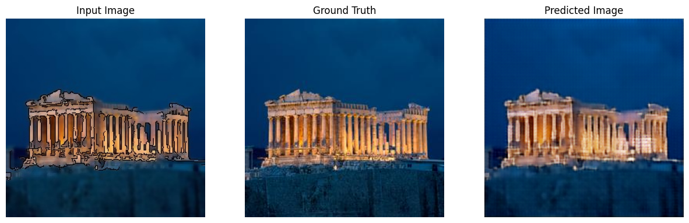
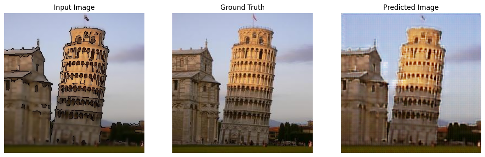

#  🖼️ Convertir Pintura en Imagen Usando Redes Generativas Antagónicas Condicionales (cGAN)






## 📖 Descripción del Proyecto
El proyecto desarrolla e implementa un modelo de redes generativas antagónicas condicionales (cGAN) para transformar pinturas simples en imágenes detalladas y realistas. Utiliza técnicas avanzadas de procesamiento de imágenes, visión por computadora y aprendizaje profundo. Las pinturas iniciales fueron generadas y procesadas con la biblioteca OpenCV (cv2), almacenadas en una carpeta para su posterior uso en el entrenamiento del modelo. Este enfoque destaca el potencial de las cGAN en aplicaciones artísticas y visuales, además de hacer uso de traducción imagen a imagen (Pix2Pix).

### 🛠 Tecnologías Utilizadas
- Red Neuronal: Conditional GAN (cGAN).
- Lenguaje de Programación: Python (Jupyter Notebook).
- Librerías:
    - Numpy
    - Matplotlib
    - PIL (Python Imaging Library)
    - PyTorch
    - TensorFlow
    - tqdm
    - os

### 🎯 Características Principales
- Conjunto de Datos:
    - Total imágenes: 600
        - Imágenes sin augmentation: 150
        - Imágenes con augmentation (Rotación, Rotación Horizontal y Blur): 450
    - Conjunto de entrenamiento:
        - Imágenes para entrenamiento: 500
        - Imágenes para test: 100
        - Tamaño Batch: 1
    - Tasa de Aprendizaje: 2e-4
    - Épocas: 5000

- Transformación de imágenes originales a pintura con cv2:
    - Filtro Bilateral (cv2.bilateralFilter)
    - Detección de Bordes (cv2.Canny)
    - Combinar efectos para resultado (cv2.bitwise_and)


### 📦 Instalación

```
# Clonar el Repositorio
git clone https://github.com/DonLuisM/Vehicles_detection_YOLO.git
```

### 🚀 Próximos Pasos

- Mejorar los parametros de los filtros para un mayor rendimiento del modelo con su arquitectura U-NET.
- Mejorar la calidad de las imágenes generadas con técnicas avanzadas de ajuste de hiperparámetros y batchsize.
- Incrementar el conjunto de datos de entrenamiento para lograr resultados más consistentes.

### 🤝 Contribuciones
¡Las contribuciones son bienvenidas! Si deseas colaborar en este proyecto, siéntete libre.
